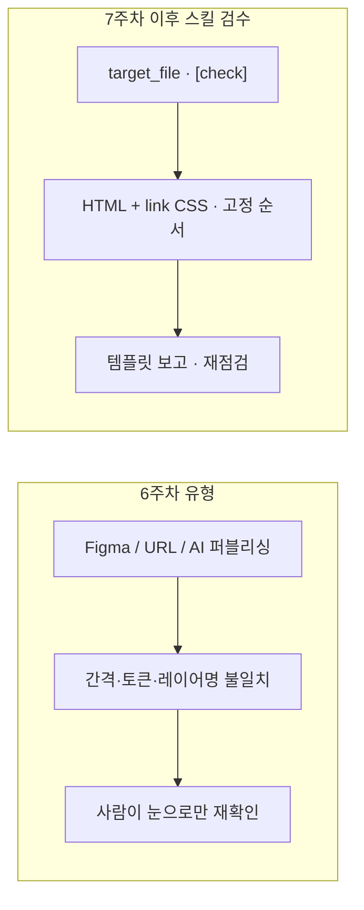

# 7주차 — Cursor 스킬로 디자인 가이드 검수 (해당 HTML 페이지 포함)

**노션 페이지:** [7주차](https://www.notion.so/7-344f14c385e0803c894af219e151da11?source=copy_link) — Cursor **Notion MCP**(`user-Notion`)로 본문 동기화 가능.

## 배경 (6주차와의 연결)

- [6주차 노션](https://www.notion.so/6-341f14c385e080ea9eb2f4192106efcf?source=copy_link)에서 정리한 것처럼, 시안·Figma·URL 참고만으로 AI 퍼블리싱을 하면 **여백·토큰·접근성·금지 규칙** 등이 의도와 어긋날 수 있음.
- 이슈를 사람이 눈으로만 재검토하는 대신, **저장소에 있는 실제 마크업/CSS**를 기준으로 워크스페이스 룰에 맞춰 점검하는 절차를 Cursor 안에서 고정함.

## 목표

- Cursor에서 **`design-guide-auditor` 스킬**을 사용해 검수를 요청하면, 지정한 **대상 HTML**에 대해서는 **같은 파일 내부 `<style>` + `<link rel="stylesheet">`로 연결된 CSS**를 항상 함께 읽고 디자인 가이드 검수를 수행함.
- 결과는 **PASS/FAIL**, **High / Medium / Low** 건수, 규칙별 근거·수정 가이드 형태로 정리됨.

## 예시: `pub-guide/pages/test4_new_v2.html` — 그냥 검수 vs 스킬 검수

같은 파일이라도 **요청 방식**에 따라 깊이·형식·재현성이 달라질 수 있음. 아래는 대표적인 차이.

### 그냥 검수할 때 (일반 대화)

- 예: “`pub-guide/pages/test4_new_v2.html` 디자인 가이드 맞는지 검수해줘.”
- **점검 범위·순서**가 대화·모델 응답에 따라 들쭉날쭉할 수 있음. `00-core`부터 `90-figma-web-raster-export`까지 매번 같은 순서로 전부 본다는 보장이 약함.
- **산출 형식**이 매번 달라질 수 있어, 나중에 다시 검수했을 때 **이전 결과와 줄-by-줄 비교**가 어려움.
- **`mode` / `strict`**를 적지 않으면, 점검 깊이·엄격도가 **암묵적**으로만 결정됨.
- 페이지에 `<link rel="stylesheet">` 등으로 **외부 CSS**가 있어도, 일반 요청만으로는 HTML만 보고 끝나기 쉬움.

### 스킬(`design-guide-auditor`)을 쓸 때 · `[check]`로 같은 파일을 줄 때

- 예: “`design-guide-auditor` 스킬로 `pub-guide/pages/test4_new_v2.html` **full** 검수” 또는 해당 파일을 연 뒤 **`[check]`**.
- 스킬에 정한 **점검 순서·체크리스트·심각도(High/Medium/Low)** 를 따르므로 **같은 기준으로 반복 검수**하기 쉬움.
- HTML이면 **연결 스타일시트까지 읽는 절차**가 스킬에 고정되어 있음.
- **`quick` / `full`**, **`strict`** 를 명시하면 “빠른 점검 vs 전체 점검 vs 엄격”을 **의도대로 고정**할 수 있음.
- 보고는 **PASS/FAIL·건수·Findings 템플릿**에 맞추므로 노션·PR·이슈에 **붙여 넣기·추적**에 유리함.
- `test4_new_v2.html`처럼 **마크업과 연결 CSS가 함께** 정합을 가르는 경우, 스킬 절차에 맞춰 읽으면 **일반 요청 대비 놓치기 어려운 항목**(예: `20-style-convention` 금지 패턴이 CSS 쪽에만 있는 경우)을 짚기 쉬움.

## 사용 방법

1. Cursor 채팅에서 점검할 **HTML 파일 경로**를 명시하거나, 아래 **훅 접두사**로 현재 열린 파일을 대상으로 할 수 있음.
2. `design-guide-auditor` 스킬에 맞게 **디자인 가이드 검수**를 요청함.

### `[check]` 접두사 — 경로 생략 시 **현재 포커스 파일**

- 프롬프트를 **`[check]`**, **`[check-quick]`**, **`[check-strict]`**, **`[check-raw]`** 로 시작하고 뒤에 경로를 붙이지 않으면, `.cursor/hooks/prefix_router.py` 훅이 **에디터에서 연 파일**을 `target_file`로 넣어 검수 요청으로 바꿈. (`[check-raw]`는 A/B용으로 스킬 절차·`[CHECK RESULT]` 템플릿 없이 `.cursor/rules`만 근거로 점검하도록 변환되며, HTML이면 **연결 CSS 읽기 범위는 `[check]`와 동일**하게 포함한다.)
- 대상 확장자: `.html`, `.css`, `.scss`. 열린 파일을 찾지 못하면 훅이 안내함.
- 경로를 같이 쓰면 해당 파일이 우선함. 예: `[check] pub-guide/pages/foo.html`

### 요청 예시

- `pub-guide/pages/xxx.html` 대상으로 design-guide-auditor 스킬로 디자인 가이드 **full** 검수해줘.
- `pub-guide/pages/test4_new_v2.html` 을 스킬 기준 **full** 로 검수해줘.
- (해당 HTML을 연 채) `[check]` 만 입력 후 전송.

## 스킬 입력 (개념)

- **`target_file`**: 점검할 HTML(또는 훅이 허용하는 CSS/SCSS) 경로. **일반 요청에서는 경로를 명시하는 것이 원칙.** `[check]` 계열 접두사만 쓰고 경로를 생략하면 **현재 연 파일**이 자동 지정됨. HTML이면 스킬 절차에 따라 **`<style>` + `<link rel="stylesheet">` 직접 연결 파일**을 항상 함께 읽음.
- **`mode`**: `quick` 또는 `full`. 기본값 `full`.
- **`strict`**: 엄격 모드 `true` / `false`. 기본값 `false`.

## 점검 순서 (고정)

1. `00-core`
2. `10-a11y-semantic`
3. `20-style-convention`
4. `30-design-guide` 및 `30-design-guide-*`
5. `90-figma-web-raster-export` (정적 에셋/export 흐름이 보일 때)

## 검수 항목 요약

### 00-core

- 상태바 구현 금지(`.os-status-bar`, `.status-bar-content` 등)
- 클래스 **kebab-case**
- 임의 spacing/size 값 남용 여부
- 주석·구조 가독성 등 기본 품질

### 10-a11y-semantic

- 문서 `lang`, 제목(heading) 계층, landmark(`header` / `main` / `section` / `nav` / `footer`)
- 의미 이미지 `alt`, 장식 이미지 `alt=""`
- 아이콘 버튼 `aria-label`
- 폼 요소 `label` / `aria-labelledby` 연결
- 키보드 접근성

### 20-style-convention

- `display: grid` 사용 금지
- flex 컨테이너의 `gap` 사용 금지
- 형제 선택자 간격 규칙 충돌 여부
- 텍스트 넘침 처리(`min-width: 0` 등) 누락 여부

### 30-design-guide 시리즈

- layout/spacing 토큰 정합
- parent inset + child 100% 패턴 위반 여부
- radius / typography / icon 스펙 위반 여부
- 컴포넌트(Button·Chip·Dropdown·Textfield 등) 상태·사이즈 정합

### 90-figma-web-raster-export

- 원본 에셋 직다운로드 사용 여부
- Figma **Export** 기준 파일 수집 여부
- 포맷·배율 규칙 준수 여부

## 심각도 기준

- **High**: 접근성·정책 위반, 금지 규칙 위반(grid, flex gap, 상태바 등)
- **Medium**: 디자인 정합 훼손 가능성이 큰 항목(토큰 불일치, 컴포넌트 스펙 이탈)
- **Low**: 문서화·가독성·일관성 개선 항목

## 기대 산출물 (보고 템플릿)

에이전트는 아래 형식에 맞춰 보고함.

```markdown
**[적용 룰]** 전사 공통 (00-core) + 30-design-guide

[CHECK RESULT]
- Status: PASS | FAIL
- Target: <path>
- Mode: <quick|full>, strict=<true|false>
- Summary: High <n> / Medium <n> / Low <n>

[Findings]
1. [High] <rule-id>
   - File: `<path>`
   - Snippet: `<문제 코드 또는 패턴>`
   - Why: <왜 위반인지>
   - Fix: <수정 가이드>
```

## 한계·유의사항

- 검수 대상은 **리포지토리에 존재하는 파일**이어야 함(일반적으로 HTML; `[check]` 훅은 `.css`/`.scss` 연 파일도 대상으로 할 수 있음). Figma만 있고 저장소에 마크업이 없으면 `target_file`을 먼저 확정해야 함.
- HTML이면 스킬상 **직접 링크한 CSS**는 따라가지만, 빌드 단계에서만 합쳐지는 스타일·런타임 주입 스타일은 자동으로 전부 커버하지 못할 수 있음 → **확인 필요**로 분리될 수 있음.
- 발견이 없어도(PASS) **미검증 영역**이 있으면 보고 끝에 명시하는 것이 스킬 규칙임.

## 6주차 대비 효과

- AI가 구현한 **그 페이지 파일**을 경로로 지정하면, **동일한 가이드 기준으로 반복 점검**이 가능해져 6주차에서 관찰된 유형의 불일치를 줄이기 쉬움.

### 한눈에 비교 (표)

| 구분 | 6주차에서 정리된 상황 | 스킬·`[check]` 적용 후 |
| --- | --- | --- |
| **근거** | 시안·Figma·URL·대화 위주 | **저장소의 HTML + 직접 연 CSS** |
| **검토 흐름** | 응답마다 순서·깊이가 달라질 수 있음 | **00-core → … → 90** 고정 순서 |
| **산출물** | 형식이 들쭉날쭉 | **PASS/FAIL·건수·Findings** 템플릿 |
| **반복** | “또 틀렸다” 재현·비교가 어려움 | **같은 `target_file`로 재점검·추적** 용이 |
| **대표 이슈** | 레이어명 vs 속성, 여백 누락, CSS 미검 | 링크 CSS까지 절차에 포함 |

### 흐름도 (Mermaid)

아래는 Cursor·GitHub 등 **Mermaid를 지원하는 미리보기**에서 렌더됨. 노션은 환경에 따라 코드 블록으로만 보일 수 있음 → 그때는 [Mermaid Live Editor](https://mermaid.live)에서 PNG/SVG로 내보낸 뒤 페이지에 이미지로 붙이면 됨.



## 참고 (저장소)

- 스킬 정의: `apps/.cursor/skills/design-guide-auditor/SKILL.md`
